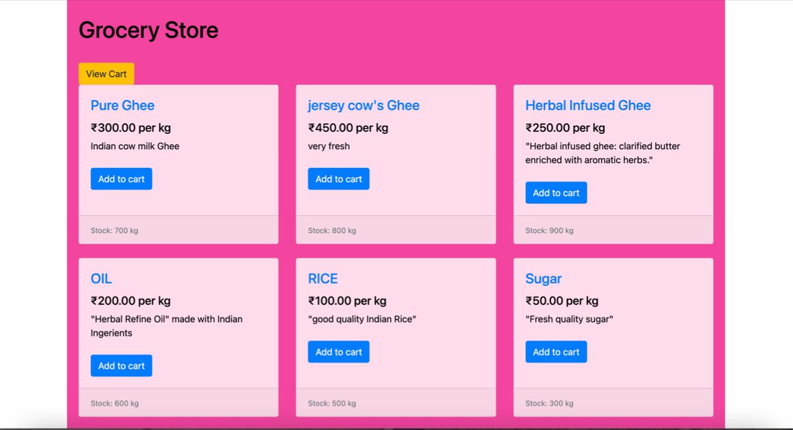

# Grocery Store Application



## Description
This is a web-based grocery store application developed using Django. It allows users to browse, search, and purchase grocery items online.

## Features
- User authentication (signup, login, logout)
- Product listing and search
- Shopping cart functionality
- Order management
- Admin panel for managing products, categories, and orders

## Technologies Used
- Django
- HTML
- CSS
- JavaScript
- Bootstrap
- SQLite (default database, can be changed to PostgreSQL or MySQL)

## Installation

### Prerequisites
- Python 3.x
- Django 3.x or above

### Steps
1. Clone the repository:
    ```bash
    git clone https://github.com/yourusername/grocery-store.git
    cd grocery-store
    ```

2. Create a virtual environment and activate it:
    ```bash
    python -m venv venv
    source venv/bin/activate  # On Windows use `venv\Scripts\activate`
    ```

3. Install the required packages:
    ```bash
    pip install -r requirements.txt
    ```

4. Apply migrations:
    ```bash
    python manage.py migrate
    ```

5. Create a superuser:
    ```bash
    python manage.py createsuperuser
    ```

6. Run the development server:
    ```bash
    python manage.py runserver
    ```

7. Open your browser and navigate to `http://127.0.0.1:8000` to access the application.

## Usage
1. Register a new user account or login with existing credentials.
2. Browse products and add them to your cart.
3. Proceed to checkout to place an order.
4. Admins can access the admin panel at `http://127.0.0.1:8000/admin` to manage products, categories, and orders.

## Project Structure
grocery-store/
│
├── grocery_store/
│ ├── settings.py
│ ├── urls.py
│ └── ...
│
├── store/
│ ├── models.py
│ ├── views.py
│ ├── urls.py
│ ├── templates/
│ ├── static/
│ └── ...
│
├── manage.py
├── requirements.txt
└── README.md


## Contributing
1. Fork the repository.
2. Create a new branch: `git checkout -b feature-branch-name`.
3. Make your changes and commit them: `git commit -m 'Add some feature'`.
4. Push to the branch: `git push origin feature-branch-name`.
5. Submit a pull request.

Developed by @Abhishek
